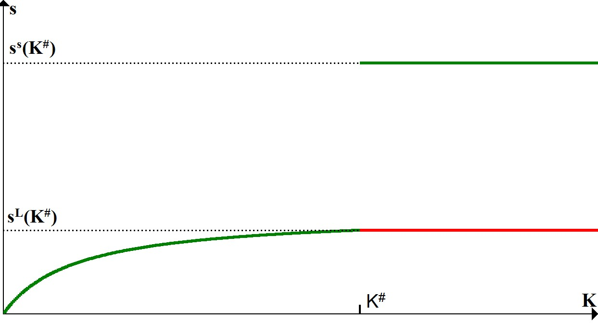

% Growth and Regional Development
% Lewis Model Assignment
% by Berend Stofferis 941240

Derivation of the Lewis Model
================

Main Building Blocks
--------

\begin{alignat}{2}
&[1] &&\hspace{0.2cm}Y_S=A_SL_S\\
&[2] &&\hspace{0.2cm}w_S=A_S\\
&[3] &&\hspace{0.2cm}Y_M=A_MK^\alpha L_M^{1-\alpha}\\
&[4] &&\hspace{0.2cm}w_M=[1-\alpha]{Y_M}/{L_M}\\
&[5] &&\hspace{0.2cm}L=L_M+L_S\\
&[6] &&\hspace{0.2cm}w_M=\phi w_S\\
&[7] &&\hspace{0.2cm}\dot{K}= s_{\pi}[Y_M-w_M L_M ]-{\delta}K
\end{alignat}

Static Equilibria
--------
\begin{alignat}{2}
&[8] &&\hspace{0.2cm}L_m=K((1-{\alpha})A_m/{\phi}A_s)^{1/{\alpha}}\\
&[9] &&\hspace{0.2cm}L_s=L-K((1-{\alpha})A_m/{\phi}A_s)^{1/{\alpha}}\\
&[10] &&\hspace{0.2cm}K<L-K({\phi}A_s/(1-{\alpha})A_m)^{1/{\alpha}}\hspace{0.1cm}{\equiv}\hspace{0.1cm}K^{\#}\\
&[11] &&\hspace{0.2cm}Y_s=A_sL-A_sK((1-{\alpha})A_m/{\phi}A_s)^{1/{\alpha}}\\
&[12] &&\hspace{0.2cm}Y_m=KA_m((1-{\alpha})A_m/{\phi}A_s)^{(1-\alpha)/\alpha}\\
&[13] &&\hspace{0.2cm}Y_m-w_mL_m{\alpha}KA_m((1-{\alpha})A_m/{\phi}A_s)^{(1-\alpha)/\alpha}\\
&[14] &&\hspace{0.2cm}Y=A_sL+KA_s({\phi/(1-\alpha)-1})((1-{\alpha})A_m/{\phi}A_s)^{1/\alpha}\\
\end{alignat}

Dynamics
--------
\begin{alignat}{2}
&[15] &&\hspace{0.2cm}\hat{K}={\alpha}s_{\pi}A_m((1-{\alpha})A_m/{\phi}A_s)^{(1-\alpha)/\alpha}-{\delta}\\
&[16] &&\hspace{0.2cm}\hat{L}_m=\hat{K}\\
&[17] &&\hspace{0.2cm}\hat{Y}_s=-\hat{K}\frac{A_s((1-{\alpha})A_m/{\phi}A_s)^{1/{\alpha}}}{A_sL/K-A_s((1-{\alpha})A_m/{\phi}A_s)^{1/{\alpha}}}\\
&[18] &&\hspace{0.2cm}\hat{Y}_m=\hat{K}\\
&[19] &&\hspace{0.2cm}\hat{Y}=\hat{K}(1-A_sL/Y)
\end{alignat}

Saving Rate Assumptions
=================

Notation
--------
- $s$: the savings rate as a fraction of $Y$.
- $s_{Y_m}$: the savings rate as a fraction of $Y_m$.
- $s_{\pi}$: the savings rate as a fraction of profits.

--------

Adjust Solow Model
--------
- What happens when we set $s_{\pi}^S=s_{\pi}^L$?
- The gap in the savings rate function disappears!

--------

Adjust Lewis Model I
--------
- Instead we could also set $s_{Y_m}=s^S$.
- Now the savings rate over the Lewis range shifts upwards.

--------

--------

Adjust Lewis Model II
--------
- The last option is to set $s^L=s^S$.
- Again, the savings rate over the Lewis range shifts upwards.

-------

Unified Growth from Lewis to Solow
=============

Final Remarks
--------
- Here I will finish this presentation.
- Like the Latex file, no new commands are required beyond this point.
- I hope you have enjoyed reviewing this slideshow.